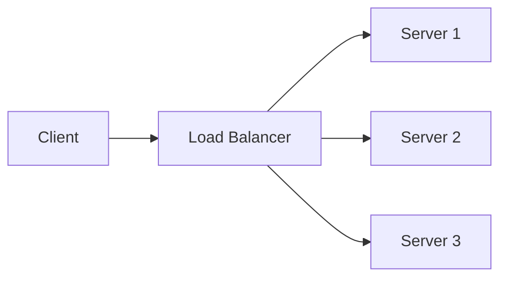

# Article Enhancement Plan — System Design 101

A detailed plan for elevating all 149 articles to a consistent, professional standard.
Written after auditing the full repo: article structures, formatting patterns, and rendering context.

---

## Current State Audit

### What exists (two distinct article styles)

**Style A — Remote articles (~138 articles)**
- Interactive, analogy-driven, gamified ("Pause and think", "Challenge", "Progressive reveal")
- Cloudinary-hosted diagrams (real images, not ASCII)
- Heavy emoji use (🎯 🎬 📊 🔑)
- Often missing H1 headings (38 articles start at H2)
- Backslash escape artifacts (`\-`, `\!`, `\*`) from CMS export — 89 articles affected
- Inconsistent Key Takeaways (only 23/149 articles have them)
- Some missing CMS frontmatter (11 articles)
- Inline `**bold**` is often the primary formatting tool, overused

**Style B — Our generated articles (~11 articles)**
- Technical, interview-prep focused, denser
- ASCII diagrams only (no images)
- No emoji
- Always has H1, frontmatter, Key Takeaways
- No interactive "Pause and think" questions
- Missing the warmth and engagement of Style A

### Key formatting bugs found
- 89 articles have backslash escapes (`\-`, `\!`, `\*`, `\,`) — CMS export artifact, breaks rendering
- 11 articles missing frontmatter entirely
- 126 articles missing Key Takeaways section
- 38 articles missing H1 heading (title only comes from frontmatter)
- Inconsistent heading depth: some use `##` as top-level, some `###`

---

## Goals

1. **One visual language** — every article feels like it was written by the same team
2. **Professional rendering** — no broken escapes, consistent heading hierarchy, proper callout blocks
3. **Engagement parity** — all articles have the interactive elements that make Style A great
4. **Structural completeness** — frontmatter, H1, sections, Key Takeaways on every article
5. **Preserve all Cloudinary images** — untouched, they are an asset not a liability

---

## The Target Article Structure

Every article, regardless of topic or level, should follow this structure:

```
---
slug: topic-slug
title: Full Article Title
readTime: X min
orderIndex: N
premium: false
---

# Full Article Title

> One-line hook: what problem this solves and why it matters.

---

## The Problem (or Opening Scenario)

[Concrete, relatable scenario that makes the reader feel the pain point]

> 💡 **Pause and think:** [Question that makes the reader engage before reading on]

---

## [Core Concept 1]

[Explanation]

[Diagram — image if available, ASCII if not]

### Key insight

> [Blockquote callout with the single most important point of this section]

---

## [Core Concept 2]

...

---

## [Comparison / Trade-offs]

| Option | Pros | Cons | Use when |
|--------|------|------|----------|
| ...    | ...  | ...  | ...      |

---

## Real-World Example

[How a company you've heard of actually uses this]

---

## Common Mistakes

| ❌ Mistake | ✅ Correct approach |
|-----------|-------------------|
| ...       | ...               |

---

## Key Takeaways

1. **[Most important point]** — one sentence elaboration
2. **[Second point]** — one sentence elaboration
...
```

---

## Enhancement Specifications

### 1. Fix Backslash Escape Artifacts (89 articles — scriptable)

**Problem:** CMS export left literal backslashes before punctuation:
```
HLD vs LLD \- The Architect's Tale      →  should be: HLD vs LLD - The Architect's Tale
open source\!                           →  should be: open source!
\* bullet point                         →  should be: * bullet point (or - bullet point)
```

**Fix:** A single sed/Python script across all affected files.
```python
# Pattern: remove backslash before: - ! * , . ( ) [ ] #
re.sub(r'\\([!*\-.,()[\]#])', r'\1', content)
```

**Risk:** Low. Only removing backslashes before punctuation. No content change.
**Effort:** 30 minutes to script, test, and apply.

---

### 2. Add Missing Frontmatter (11 articles — scriptable)

**Articles missing frontmatter:**
```
system-design-advanced/architectural-patterns/04-api-gateway-vs-service-mesh.md
system-design-advanced/caching-and-performance/05-edge-computing-and-edge-caching.md
system-design-advanced/distributed-algorithms/04-double-ratchets.md
system-design-advanced/distributed-algorithms/06-two-and-three-phase-commit.md
system-design-advanced/distributed-algorithms/11-hinted-handoff.md
system-design-advanced/distributed-algorithms/13-linearizibility-and-sequential-consistency.md
system-design-advanced/distributed-algorithms/14-casual-consistency.md
system-design-advanced/event-driven-architecture/01-event-sourcing-at-scale.md
system-design-advanced/event-driven-architecture/02-complex-event-processing.md
system-design-advanced/event-driven-architecture/03-transactional-outbox-pattern.md
system-design-advanced/event-driven-architecture/05-event-mesh-archiecture.md
```

**Fix:** Derive slug from filename, title from first H1/H2 heading, orderIndex from filename number.
Scriptable with a Python script.

---

### 3. Fix Heading Hierarchy (38 articles — scriptable)

**Problem:** 38 articles start at `##` with no `#` H1 heading. The CMS likely renders the
`title` from frontmatter as the page H1, but for standalone markdown viewing it looks broken.
Also some articles use `##` for what should be `###` (subsections).

**Fix:**
- If article has frontmatter `title` but no `# H1`: add `# {title}` as first line after frontmatter
- Audit heading depth: top-level sections should be `##`, subsections `###`, sub-subsections `####`
- Cap at 4 heading levels maximum

**Script logic:**
```python
if not content.startswith('# ') after frontmatter:
    insert: f"# {frontmatter['title']}\n\n"
```

---

### 4. Standardize Section Structure (manual, batched by article type)

Every article needs these sections. Current coverage:

| Section | Coverage |
|---------|----------|
| Frontmatter | 92% (11 missing) |
| H1 heading | 75% (38 missing) |
| Opening hook/scenario | ~80% (good in remote articles) |
| "Pause and think" | ~60% (remote articles have, ours don't) |
| Comparison tables | ~47% (71/149) |
| Real-world examples | ~70% |
| Common mistakes | ~20% |
| Key Takeaways | ~15% (23/149) |

**Priority additions:**
- Key Takeaways to all articles (126 need it) — highest priority, most visible
- "Pause and think" to our 11 generated articles — make them match Style A
- Common mistakes section to intermediate and advanced articles

---

### 5. Callout Blocks — Consistent Use of Blockquotes

The remote articles sometimes use `>` blockquotes for callouts but inconsistently.
The target is a consistent callout system:

```markdown
> 💡 **Key insight:** This is the most important point of this section.

> ⚠️ **Common mistake:** What people get wrong here.

> 🔍 **Pause and think:** Question for the reader before the answer is revealed.

> 📌 **Real world:** How this works at Netflix/Google/Amazon.
```

These render as styled callout boxes in most website markdown renderers.
Currently only ~43 articles use blockquotes at all, and inconsistently.

---

### 6. Code Block Language Tags (scriptable audit)

Code blocks without language tags miss syntax highlighting:

```
```                     ← no syntax highlighting
SELECT * FROM users
```

```sql                  ← highlighted
SELECT * FROM users
```
```

**Common missing tags to add:**
- SQL queries → ` ```sql `
- JavaScript → ` ```javascript `
- Python → ` ```python `
- Go → ` ```go `
- Shell commands → ` ```bash `
- JSON → ` ```json `
- HTTP requests/responses → ` ```http `
- Config/YAML → ` ```yaml `
- Generic pseudocode/architecture → ` ```text ` (not left blank)

**Script approach:** Heuristic detection — if block contains `SELECT/INSERT/CREATE TABLE` → sql,
`{` + `"key":` → json, `POST/GET http` → http, etc.

---

### 7. Tables — Consistent Formatting and Expansion

Many articles use bullet points where a comparison table would be clearer.
Target pattern for any time you're comparing 2+ options across 2+ dimensions:

```markdown
| Approach | When to use | Trade-off |
|----------|------------|-----------|
| Option A | High write workloads | Higher read latency |
| Option B | High read workloads | Higher write latency |
```

Articles that most need table upgrades:
- Caching patterns (currently mostly prose)
- Database choice articles
- Any article with "Pros/Cons" sections in bullet form

---

### 8. "Common Mistakes" Section — Add to Intermediate and Advanced

Currently very few articles have this. It's high-value because:
- It's what people search for ("common mistakes in X")
- It makes articles feel authoritative and senior
- It prevents the reader from making the mistake themselves

Standard format:
```markdown
## Common Mistakes

| ❌ Mistake | Why it's wrong | ✅ Correct approach |
|-----------|---------------|-------------------|
| ... | ... | ... |
```

---

### 9. "Pause and Think" — Add to Our Generated Articles

Our 11 generated articles (system design problems + CAP theorem + consistent hashing
+ rate limiting + search + blob storage + CDN) are missing the interactive element
that makes the remote articles engaging.

Add 1-2 "Pause and think" questions per article at natural decision points:

```markdown
> 🔍 **Pause and think:** If a user sends the same payment request twice due to a
> network timeout, what's the worst case without idempotency?
```

---

### 10. Opening Hook Standardization

Every article should open with one sentence that answers "why does this matter to me?":

```markdown
# Database Sharding

> At 10 million users, a single database becomes a bottleneck. Sharding is how
> Instagram, Discord, and Uber broke that ceiling — and how you'll design systems at scale.
```

Currently about 30% of articles have a compelling opening hook.
The rest dive straight into definitions or challenges without context.

---

## On the Cloudinary Images — Should We Replace Them?

### Current state
The remote articles have real Cloudinary-hosted diagrams. Examples seen:
- Architecture diagrams (HLD vs LLD comparison)
- Data flow diagrams
- Comparison charts
- Conceptual visualizations

These are genuinely good — professionally designed, clear, render beautifully.

### Option A: Leave them as-is (recommended for now)
**Pros:** They already work, look great, and are on a fast CDN.
**Cons:** We don't control them — if Cloudinary billing lapses or URLs change, images break.

### Option B: Mermaid diagrams (most realistic upgrade path)
Mermaid is a text-based diagramming language that many website renderers support natively
(GitHub, Notion, many CMS platforms). It would let us write diagrams as code:



**Pros:**
- Version-controlled (diagrams live in the markdown file)
- No external dependency
- Renders automatically if the website supports it
- Can be updated without design tools

**Cons:**
- Algoroq website must support Mermaid rendering (needs to be confirmed)
- Not as visually polished as custom-designed Cloudinary images
- Sequence diagrams and flow charts work well; complex architecture diagrams are harder

**Verdict:** Mermaid is realistic IF the Algoroq renderer supports it. Worth checking.
If it does, we should add Mermaid diagrams to our generated articles (which currently
have ASCII art only) as a first step — not replace the existing Cloudinary images.

### Option C: Recreate with an AI image tool (not recommended yet)
Tools like Eraser.io, Whimsical, or Excalidraw can generate architecture diagrams.
You could use these to create images, upload to Cloudinary, and replace or supplement.

**Reality check:**
- 138 articles × 1-3 diagrams each = potentially 300+ diagrams to create
- Each diagram needs to be accurate to the article's content
- This is weeks of work even with AI assistance
- The existing images are already good quality

**Verdict:** Not worth doing as a first pass. If specific articles need better diagrams
(e.g., our generated articles that only have ASCII art), targeted creation makes sense —
but a wholesale replacement project is premature.

### Recommended image strategy
1. **Immediate:** Leave all existing Cloudinary images untouched
2. **Short term:** Add Mermaid diagrams to our 11 generated articles (replacing ASCII art)
   — but only after confirming the Algoroq renderer supports Mermaid
3. **Long term:** Download and re-host the Cloudinary images on your own storage
   (Algoroq's S3/Cloudinary account) so you control the URLs and uptime

---

## Implementation Order (by impact vs effort)

| Priority | Enhancement | Articles affected | Effort | Impact |
|----------|------------|------------------|--------|--------|
| 1 | Fix backslash escape artifacts | 89 | Low (script) | High (broken rendering) |
| 2 | Add missing frontmatter | 11 | Low (script) | High (CMS won't render) |
| 3 | Add H1 headings to articles missing them | 38 | Low (script) | Medium |
| 4 | Add Key Takeaways to all articles | 126 | High (manual) | High |
| 5 | Add language tags to code blocks | All | Medium (script + manual) | Medium |
| 6 | Standardize callout blockquotes | All | Medium (manual) | Medium |
| 7 | Add "Pause and think" to generated articles | 11 | Low (manual) | Medium |
| 8 | Add opening hooks | ~100 | High (manual) | Medium |
| 9 | Add "Common mistakes" sections | ~80 | High (manual) | Medium |
| 10 | Add Mermaid diagrams (if renderer supports) | 11 | Medium | High |
| 11 | Convert prose comparisons to tables | ~40 | Medium (manual) | Medium |

---

## What Can Be Scripted vs What Needs Manual Work

### Fully scriptable (no content judgment needed)
- Fix backslash escapes
- Add frontmatter to the 11 missing articles
- Add H1 headings derived from frontmatter title
- Add language tags to code blocks (heuristic detection)
- Check and report all remaining structural issues

### Requires manual writing (content judgment)
- Key Takeaways (must understand the article)
- Opening hooks (must match article tone)
- "Pause and think" questions (must be at the right moment)
- "Common mistakes" sections (requires domain knowledge)
- Callout block placement (requires reading the article)

---

## Suggested Execution Approach

### Phase 1 — Automated fixes (1-2 days)
Run scripts for: backslash escapes, frontmatter, H1 headings, code block language tags.
Commit each fix separately for clean git history.
Result: structurally sound articles with no rendering bugs.

### Phase 2 — Structural additions (1-2 weeks, batched by section)
Work through sections in order: intro → intermediate → advanced.
For each article: add Key Takeaways, opening hook, and callout blocks.
Batch by section and commit per section (e.g., "Add Key Takeaways to caching-fundamentals").

### Phase 3 — Depth additions (ongoing)
Add "Common mistakes", "Pause and think", and comparison tables.
These can be done article-by-article over time as a continuous improvement process.

### Phase 4 — Diagrams (after confirming renderer support)
Add Mermaid diagrams to the 11 generated articles.
Evaluate whether to extend to other articles based on rendering results.
