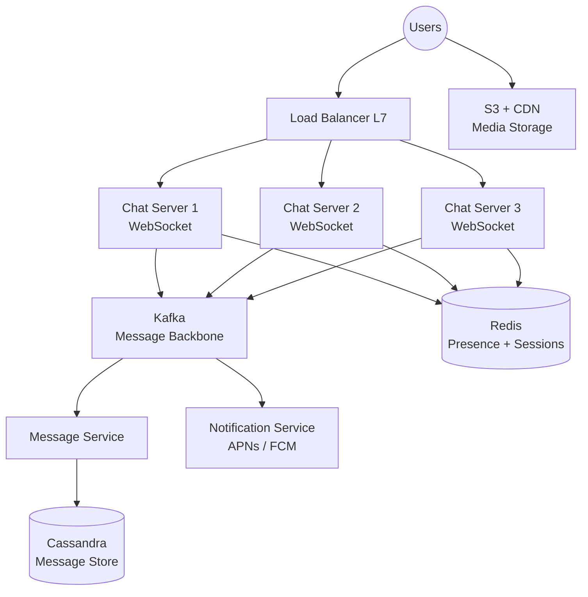

# Design a Chat System

Design a real-time messaging system supporting 1:1 and group chat, online presence, and message history — similar to WhatsApp, Slack, or Discord.

---

## Step 1: Requirements

### Functional Requirements
- 1:1 direct messaging between users
- Group messaging (up to 500 members per group)
- Message delivery: sent → delivered → read receipts
- Online/offline presence indicators
- Message history with pagination
- Media sharing (images, files)
- Push notifications for offline users

### Non-Functional Requirements
- Low latency: messages should appear in < 100ms (same region)
- High availability: 99.99%
- Consistency: messages delivered in order; no duplicates
- Scale: 50 million daily active users, 100 messages/user/day = 5 billion messages/day

### Out of Scope
- Voice/video calls
- End-to-end encryption details
- Message reactions, threads

---

> **Pause and think:** Why can't we use regular HTTP request-response for chat messages? What happens if a user has the app open and a new message arrives?

## Step 2: Back-of-Envelope Estimation

```
Messages per day: 50M users × 100 msg/day = 5 billion messages
Messages per second: 5B / 86,400 ≈ 58,000 msg/sec

Storage per message: ~500 bytes (text, metadata)
Storage per day: 5B × 500 bytes = 2.5 TB/day
Storage per year: ~900 TB

Active WebSocket connections at peak:
  50M DAU, ~30% online at peak = 15 million concurrent connections
  At 1 connection/user = 15M WebSocket connections
```

---

## Step 3: Protocol Choice

### Why WebSockets for Chat?

```
HTTP Polling (❌ bad for chat):
  Client asks "any new messages?" every second
  99% of polls return nothing → wasteful
  1-second latency minimum

Long Polling (⚠️ acceptable):
  Client makes request, server holds until message arrives
  1 open connection per client, moderate latency
  Teardown/reconnect on each message

WebSocket (✅ best for chat):
  Single persistent bidirectional connection
  Server pushes messages instantly when they arrive
  ~50ms latency, minimal overhead
```

---

## Step 4: API Design

```
WebSocket Events (real-time):
  Client → Server:
    { "type": "message.send", "conversation_id": "conv_123",
      "content": "Hello!", "client_msg_id": "c_abc" }  ← idempotency key

  Server → Client:
    { "type": "message.new", "message_id": "m_456",
      "conversation_id": "conv_123", "sender_id": 42,
      "content": "Hello!", "timestamp": "..." }

  Server → Client (delivery updates):
    { "type": "message.delivered", "message_id": "m_456" }
    { "type": "message.read", "message_id": "m_456", "reader_id": 99 }

  Presence:
    { "type": "user.online", "user_id": 42 }
    { "type": "user.offline", "user_id": 42 }

REST APIs (for non-realtime operations):
  GET /conversations                       → list conversations
  GET /conversations/{id}/messages?before=cursor  → paginate history
  POST /conversations                      → create conversation
  POST /media/upload                       → get presigned URL for upload
```

---

## Step 5: Data Model

```sql
-- Conversations (groups or 1:1)
CREATE TABLE conversations (
  id          UUID PRIMARY KEY,
  type        ENUM('direct', 'group') NOT NULL,
  name        TEXT,                         -- group name, null for DM
  created_at  TIMESTAMP DEFAULT NOW()
);

-- Conversation participants
CREATE TABLE participants (
  conversation_id UUID REFERENCES conversations(id),
  user_id         BIGINT NOT NULL,
  joined_at       TIMESTAMP DEFAULT NOW(),
  last_read_at    TIMESTAMP,                -- for unread count
  PRIMARY KEY (conversation_id, user_id)
);

-- Messages
CREATE TABLE messages (
  id              UUID PRIMARY KEY,
  conversation_id UUID REFERENCES conversations(id),
  sender_id       BIGINT NOT NULL,
  content         TEXT,
  media_url       TEXT,
  created_at      TIMESTAMP DEFAULT NOW(),
  client_msg_id   VARCHAR(64) UNIQUE        -- idempotency: prevent duplicate sends
);

-- Index for message history queries
CREATE INDEX idx_messages_conv_time
  ON messages(conversation_id, created_at DESC);
```

**Database choice:** Cassandra is excellent for messages — partitioned by `conversation_id`, clustered by timestamp. Allows fast append-only writes and efficient time-range reads.

```
Cassandra schema:
  Partition key: conversation_id
  Clustering key: created_at DESC, message_id
  → All messages in a conversation on same partition
  → Newest messages first without sorting
```

---

## Step 6: High-Level Architecture

```
                              Users
                                │
                        ┌───────▼───────┐
                        │  Load Balancer │
                        │  (Layer 7)    │
                        └──────┬────────┘
                               │ routes by user_id hash
              ┌────────────────┼────────────────┐
              ▼                ▼                ▼
     ┌──────────────┐  ┌──────────────┐  ┌──────────────┐
     │  Chat Server │  │  Chat Server │  │  Chat Server │
     │      1       │  │      2       │  │      3       │
     │ (WebSockets) │  │ (WebSockets) │  │ (WebSockets) │
     │ Users A–F    │  │ Users G–M    │  │ Users N–Z    │
     └──────┬───────┘  └──────┬───────┘  └──────┬───────┘
            │                 │                 │
            └────────────┬────┘                 │
                         │                      │
            ┌────────────▼──────────────────────┘
            ▼
     ┌──────────────┐      ┌────────────────┐
     │  Message     │      │ Presence       │
     │  Service     │      │ Service        │
     └──────┬───────┘      └────────┬───────┘
            │                       │
     ┌──────▼───────┐        ┌──────▼───────┐
     │  Message DB  │        │  Redis       │
     │ (Cassandra)  │        │ (Presence)   │
     └──────────────┘        └──────────────┘
            │
     ┌──────▼───────┐      ┌────────────────┐
     │  Notification│      │  Media Storage  │
     │  Service     │      │  (S3 + CDN)    │
     └──────────────┘      └────────────────┘
```



---

## Step 7: Deep Dives

### Deep Dive 1: Message Flow

**Sender (Alice) on Chat Server 1, Receiver (Bob) on Chat Server 2:**

```
1. Alice sends message via WebSocket to Chat Server 1

2. Chat Server 1:
   a. Validates message
   b. Assigns server-side message_id and timestamp
   c. Writes to Cassandra (async, non-blocking)
   d. Publishes to Kafka topic: "messages" with partition_key=conversation_id

3. Kafka delivers to all Chat Servers subscribed to this conversation:
   Chat Server 1 (Alice is here)
   Chat Server 2 (Bob is here)

4. Chat Server 2 pushes message to Bob's WebSocket:
   { "type": "message.new", "content": "Hello!", ... }

5. Bob's client sends delivery receipt:
   { "type": "message.delivered", "message_id": "m_456" }

6. Chat Server 2 publishes delivery event to Kafka

7. Chat Server 1 delivers receipt to Alice's WebSocket
```

**Why Kafka between chat servers?**
Any chat server can serve any user's connection. Kafka acts as the pub-sub backbone so all servers can deliver messages regardless of which server holds each user's connection.

### Deep Dive 2: Message Ordering

Messages in a conversation must arrive in order:

```
Approach: Kafka partition key = conversation_id
→ All messages for conversation X go to the same Kafka partition
→ Kafka guarantees order within a partition
→ All servers see messages for a conversation in the same order

Challenge: Cassandra writes aren't instant
  Solution: Use Cassandra's monotonic timestamp clustering
  Each message gets a server-side timestamp at write time
  Clients display by server timestamp (not client timestamp)
```

### Deep Dive 3: Online Presence

```
When user connects:
  WebSocket established → Chat Server updates Redis:
    SET user:{user_id}:online 1 EX 60  (expires in 60s)
    PUBLISH presence_channel { "user_id": 42, "status": "online" }

Heartbeat:
  Client sends heartbeat every 30s
  Server refreshes Redis TTL:
    EXPIRE user:{user_id}:online 60

When user disconnects:
  WebSocket closed → DELETE user:{user_id}:online
  PUBLISH presence_channel { "user_id": 42, "status": "offline" }

Reading presence:
  GET user:{user_id}:online
  → Exists → online
  → Nil    → offline

At scale: don't track ALL users' presence for each user
  → Only track presence of users in your conversations
  → Subscribe to presence events for conversation members only
```

### Deep Dive 4: Group Chat Fan-Out

When Alice sends a message to a 500-person group:

```
Option 1: Fan-out on Write
  For each of 500 members:
    → Push message to their connection (if online)
    → Queue push notification (if offline)

  Problem: 500 writes/pushes per message. At scale: expensive.
  At 10M messages/day in groups → 5B push operations/day

Option 2: Fan-out on Read
  Store message once in group's conversation
  Each user fetches messages when they open the chat

  Problem: Each user loads messages independently → many DB reads

WhatsApp / Signal approach (hybrid):
  For small groups (< 100): fan-out on write (push to all)
  For large groups (> 100): fan-out on read (members fetch)
  → Most groups are small; only large groups use lazy loading
```

### Deep Dive 5: Push Notifications for Offline Users

```
Message arrives but Bob is offline:

1. Chat Server checks Redis: Bob is offline
2. Publish to notification queue: { "user_id": Bob, "msg": "..." }
3. Notification Service:
   → iOS: Apple Push Notification Service (APNs)
   → Android: Firebase Cloud Messaging (FCM)
4. Bob's phone receives push notification
5. Bob opens app → WebSocket reconnects → fetches missed messages via REST API
```

---

## Step 8: Scaling

### Scaling WebSocket Connections

Each WebSocket connection is persistent and stateful. Scale by:

```
1. Multiple Chat Servers — each handles a subset of connections
2. Sticky routing — route user X always to same Chat Server (use IP hash or user_id hash)
3. Auto-scaling — add Chat Servers as connection count grows
4. Connection limit per server: ~100K–500K WebSockets (depending on message rate)
```

### Scaling Message Storage

```
Cassandra scales horizontally:
  Partition by conversation_id → all messages in a conversation are co-located
  Add nodes to handle more conversations
  Replication factor = 3 for availability

Hot conversation problem:
  A very active group (1M messages/day) → hotspot on one Cassandra node
  Solution: Bucket by time: partition_key = (conversation_id, month)
            → distributes across partitions
```

---

## Common Mistakes

| Mistake | Why it's wrong | Correct approach |
|---------|---------------|-----------------|
| Using HTTP polling for real-time messages | Wastes bandwidth and adds latency | Use WebSockets for persistent, bidirectional connections |
| Storing messages in a relational DB without partitioning | Single table becomes a bottleneck at scale | Partition by conversation_id (Cassandra is ideal for this pattern) |
| No message deduplication | Network retries deliver the same message twice | Use client-generated message IDs with UNIQUE constraints |
| Fan-out on write for large groups | A message to a 10K-member group triggers 10K writes | Use fan-out on read for large groups, fan-out on write for small ones |

---

## Key Takeaways

1. **WebSockets provide persistent bidirectional connections** — essential for < 100ms message delivery
2. **Route users consistently to the same Chat Server** — enables fast in-process connection lookup
3. **Kafka decouples message delivery across Chat Servers** — Server 1 can deliver to users on Server 2
4. **Cassandra is ideal for message storage** — partition by conversation, cluster by timestamp
5. **Redis tracks online presence** — lightweight, TTL-based, near-real-time
6. **Fan-out on write for small groups, fan-out on read for large ones** — WhatsApp's hybrid approach
7. **Push notifications for offline users** — APNs/FCM ensures no message is missed

---
