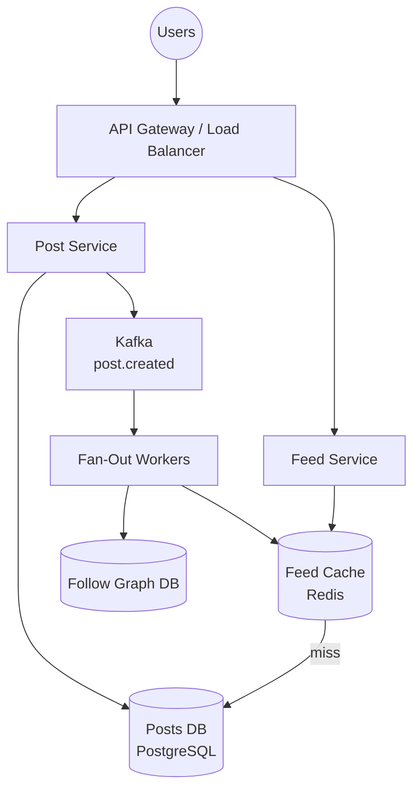

# Design a News Feed

Design a personalized news feed system like Facebook, Instagram, or Twitter — where users see a ranked stream of posts from people and accounts they follow.

---

## Step 1: Requirements

### Functional Requirements
- Users can create posts (text, images, links)
- Users can follow other users
- Each user sees a personalized feed of posts from accounts they follow
- Feed is paginated (infinite scroll)
- Feed is ranked (not purely chronological)
- Users can like and comment on posts

### Non-Functional Requirements
- High availability: feed should load even during partial outages
- Low latency: feed should load in < 500ms
- Scale: 500M daily active users, 300M posts per day, 2B feed reads per day
- Eventual consistency acceptable — a post may appear in feeds seconds to minutes after creation

---

## Step 2: Back-of-Envelope Estimation

```yaml
Writes (posts):
  300M posts/day = 300,000,000 / 86,400 ≈ 3,500 writes/sec

Reads (feed loads):
  2B reads/day = 2,000,000,000 / 86,400 ≈ 23,000 reads/sec
  Read-to-write ratio: ~7:1

Storage:
  Per post: ~1KB (text) + media references
  300M × 1KB/day = 300GB/day of text
  Media: separate object storage

Follow graph:
  500M users × avg 500 follows = 250B edges
  Stored in a graph DB or denormalized in SQL
```

---

## Step 3: Data Model

```sql
-- Users
CREATE TABLE users (
  id           BIGSERIAL PRIMARY KEY,
  username     VARCHAR(50) UNIQUE NOT NULL,
  follower_count BIGINT DEFAULT 0,   -- denormalized for fast reads
  following_count BIGINT DEFAULT 0
);

-- Posts
CREATE TABLE posts (
  id          BIGSERIAL PRIMARY KEY,
  user_id     BIGINT REFERENCES users(id),
  content     TEXT,
  media_urls  TEXT[],
  like_count  BIGINT DEFAULT 0,
  created_at  TIMESTAMP DEFAULT NOW()
);

-- Follow relationships
CREATE TABLE follows (
  follower_id   BIGINT REFERENCES users(id),
  following_id  BIGINT REFERENCES users(id),
  created_at    TIMESTAMP DEFAULT NOW(),
  PRIMARY KEY (follower_id, following_id)
);
CREATE INDEX idx_follows_following_id ON follows(following_id);
```

---

## Step 4: The Central Problem — Feed Generation

This is the design's core trade-off. Two strategies:

### Strategy A: Fan-Out on Write (Push Model)

When User A posts, immediately push the post to the feeds of all A's followers.

```
User A (10K followers) posts:
  → Write post to Posts DB
  → For each of A's 10K followers:
      → Write post_id to follower's feed cache
  → Done: feeds pre-computed

Reading a feed:
  → Read from user's feed cache (very fast)
  → Hydrate with post content
```

```
┌────────────┐     ┌──────────┐     ┌────────────────┐
│  User A    │────▶│ Post DB  │     │  Fan-Out Job   │
│  posts     │     └──────────┘     │  (async)       │
└────────────┘           │          │                │
                         └─────────▶│ For each       │
                                    │ follower:      │
                                    │ LPUSH feed:{id}│
                                    │ post_id        │
                                    └────────────────┘
                                              │
                                   ┌──────────▼──────────┐
                                   │    Feed Cache       │
                                   │    (Redis)          │
                                   │                     │
                                   │ feed:user1 → [p3, p7, p1, p9]
                                   │ feed:user2 → [p3, p5, p2]
                                   └─────────────────────┘
```

**Pros:** Feed reads are instant (just read from cache)
**Cons:** Celebrity problem — Kylie Jenner has 400M followers. Her single post triggers 400M writes. Write amplification is catastrophic.

### Strategy B: Fan-Out on Read (Pull Model)

Don't pre-compute feeds. When a user opens their feed, fetch posts from everyone they follow.

```
User B requests their feed:
  → Fetch B's 500 following IDs
  → For each followed user, fetch their recent posts
  → Merge and sort by timestamp/score
  → Return top 20

Reading a feed:
  → Query: SELECT posts WHERE user_id IN (500 following IDs) ORDER BY created_at DESC
  → Works, but: 500-way merge, heavy DB load at read time
```

**Pros:** No write amplification, posts are always fresh
**Cons:** Feed loads are slow — merge 500 users' posts at read time. Not scalable for 23K reads/sec.

### Strategy C: Hybrid (What Facebook, Instagram Actually Do)

The insight: most users don't have millions of followers. Celebrities do.

```
Regular users (< 10K followers):  Use Fan-Out on WRITE
  → When they post, push to followers' feed caches

Celebrity users (> 10K followers): Use Fan-Out on READ
  → Don't push their posts to anyone's cache
  → When a user loads their feed:
    1. Read from their pre-computed feed cache (regular accounts)
    2. Fetch latest posts from celebrities they follow (pull)
    3. Merge both lists, rank, return

Result:
  Feed reads: mostly from cache (fast)
  Celebrity posts: fetched at read time (limited — users follow few celebrities)
  No 400M-write explosions
```

---

## Step 5: Architecture

```
                       Users
                         │
              ┌──────────▼──────────┐
              │    API Gateway /    │
              │    Load Balancer    │
              └──────┬──────┬───────┘
                     │      │
          ┌──────────▼┐    ┌▼──────────┐
          │  Post      │    │  Feed     │
          │  Service   │    │  Service  │
          └──────┬─────┘    └─────┬─────┘
                 │                │
                 │         ┌──────▼──────┐
                 │         │ Feed Cache  │
                 │         │  (Redis)    │
                 │         └──────┬──────┘
                 │                │ miss
          ┌──────▼─────┐   ┌──────▼──────┐
          │ Posts DB   │   │ Fan-Out     │
          │(PostgreSQL)│   │  Workers    │
          └──────┬─────┘   └──────┬──────┘
                 │                │
          ┌──────▼────────────────▼──────┐
          │         Kafka                │
          │  (post.created events)       │
          └──────────────────────────────┘
                          │
                   ┌──────▼──────┐
                   │  Follow DB  │
                   │ (follows    │
                   │  graph)     │
                   └─────────────┘
```



---

## Step 6: Deep Dives

### Deep Dive 1: Feed Ranking

Pure chronological feeds show posts from the last hour from popular accounts, burying posts from close friends. Ranking fixes this.

**Ranking signals:**

```
Recency:       Recent posts score higher
Relationship:  Best friends > acquaintances > celebrities
Engagement:    High like/comment rate posts score higher
User behavior: Posts similar to content you've engaged with before
Content type:  Videos vs photos vs text (personalized preference)

Scoring example:
  score = w1 × recency_score
        + w2 × relationship_score
        + w3 × engagement_rate
        + w4 × content_preference_match

Weights learned via ML from user interaction data.
```

### Deep Dive 2: Feed Pagination

**Offset-based pagination (❌ broken for real-time feeds):**
```
Page 1: SELECT posts ORDER BY score LIMIT 20 OFFSET 0
Page 2: SELECT posts ORDER BY score LIMIT 20 OFFSET 20

Problem: If new post inserted before page 2 is fetched:
  → Page 1 returned posts 1-20
  → New post shifts everything down
  → Page 2 returns posts 21-40, but post 20 is now at position 21
  → Post 20 shown twice! (or post skipped)
```

**Cursor-based pagination (✅ correct for feeds):**
```
Page 1: Feed returns posts with cursor = "last_seen_score:timestamp"
Page 2: SELECT posts WHERE (score, created_at) < (cursor_score, cursor_time)
        ORDER BY score DESC LIMIT 20

→ Cursor encodes position in the sort order
→ New posts don't affect what's after the cursor
→ No duplicates or skipped posts
```

### Deep Dive 3: Handling Deletes

If a user deletes a post that's already in feed caches:

```
Option 1: Active invalidation
  Post deleted → Fan-out job removes post_id from all feed caches
  Problem: Same write amplification as publishing

Option 2: Lazy deletion
  Post deleted → marked as deleted in Posts DB
  Feed cache still contains the post_id
  When feed is served: filter out deleted posts during hydration
  → Post disappears on next feed load

Option 3: Short TTL on feed cache
  Feed cache TTL = 24 hours
  Deleted posts are gone from feeds within 24 hours automatically
```

Most platforms use a combination of lazy deletion + short TTL.

---

## Step 7: Scaling

### Feed Cache (Redis)
- Store post IDs (not content) in feed caches — saves memory
- Hydrate post details at read time from Posts DB (or a secondary cache)
- Feed cache per user: ~20 post IDs × 8 bytes = 160 bytes. 500M users = 80GB for all feed caches.

### Follow Graph
- Stored in Posts DB or dedicated graph DB
- For fan-out: pre-load follower lists into Redis when user gains followers
- `followers:{user_id}` → sorted set of follower IDs

### Sharding
- Posts DB: shard by user_id
- Feed cache: already distributed (per-user key in Redis cluster)
- Follow graph: shard by user_id (follower or following)

---

## Key Takeaways

1. **Fan-out on write is fast to read but has celebrity write amplification** — pre-computed feeds are instant but costs explode for influencers
2. **Fan-out on read eliminates write amplification** — but makes read-time merges expensive
3. **Hybrid approach (Facebook/Instagram model) is the production answer** — regular users get push, celebrities get pull
4. **Cursor-based pagination is correct for real-time feeds** — offset breaks when content changes between pages
5. **Store post IDs in feed cache, not content** — saves massive memory, hydrate at read time
6. **Feed ranking makes the product** — chronological order is rarely optimal, ML-based ranking wins
7. **Deleted posts handled lazily** — mark as deleted, filter at read time, TTL clears caches

---
